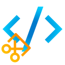

<h1 align="center">
	 
	<b>CodeCapture</b>  
</h1>

Godot Editor Plugin to capture screenshots of your code snippets 

---

## Overview

`CodeCapture` is a Godot EditorPlugin that lets you take screenshots of your code inside the Godot script editor. You can capture the entire script, as well as only the selected code. The plugin generates a clean, font-styled image perfect for sharing or documentation.

---

## Features

- Capture the **entire script** or only the **selected code**.
- Option to **expand selection** to full lines.
- Option to **append empty lines** for cleaner visuals.
- Show Godot version info on the screenshot.
- Automatically uses the editor’s font for a consistent look.
- Save screenshots in `PNG`, `JPG`, or `WebP` formats.

---

## Installation Guide
### Asset Library Installation
1. Open the "AssetLib" tab in the Godot Editor.
2. Search for `CodeCapture` in the search bar.
3. Click the download button next to the CodeCapture plugin.
4. In the installation window, select the files you want to install and click "Install".
5. Once the installation is complete, go to "Project" -> "Project Settings" -> "Plugins".
6. Find the `CodeCapture` plugin in the list and enable it by checking the box next to it.

### Installation from GitHub
1. Visit the [CodeCapture plugin GitHub repository](https://github.com/1MaxSon/code-capture).
2. Navigate to the [Releases](https://github.com/1MaxSon/code-capture/releases/latest) page.
3. Download the latest stable release version.
4. Extract the downloaded files into your Godot project's `addons` folder.

## Usage
After enabling the plugin, you’ll find a new menu button in the script editor toolbar with options:

- **Capture** — takes a screenshot of all the code.
- **Capture Selected** — only the highlighted code snippet.
- **Show Godot Version** — toggle to add Godot version label.
- **Expand Selection To Full Lines** — expands the selected block to full lines.
- **Append Empty Line** — adds extra space at the end of the captured code.

Upon capture, a file save dialog appears letting you save the screenshot in your preferred format.

---
`By 1MaxSøn`

Enjoy capturing your code beautifully!

